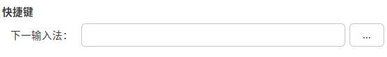

# Rime定制方案

输入法使用的是一个开源的输入法-小狼毫（不同系统上面的叫法不同）

​​

在之前的电脑上（Win，Mac）其实已经部署了，这次先在Linux上面部署一下

## Ubuntu

先安装！跟着安装文档就可以了。我习惯的切换输入法的快捷键是Ctrl+Space，基础设定是在终端中输入`ibus-setup`​，进行设定。但是！！！在这里设置的快捷键总是会默认加上Shift

​所以需要进一步直接在配置文件中更改。

> 实际上，这里修改好像没啥鸟用。。。

所以直接在安装的地方进行修改，直接创建`default.custom.ymal`​文件，可以覆盖或者增加对原本的`default.ymal`​设置。这个文件3个平台的都是一样的，这里直接贴上我的配置

```yaml
patch: 
  key_binder:
    select_first_character: "minus" # 使用 - 〔方案切换〕
    select_last_character: "equal"  # 使用 =
    bindings:
      - {accept: bracketleft, send: Page_Up, when: paging}      # 使用`[`进行向上翻页（第一页时候无效）
      - {accept: bracketright, send: Page_Down, when: has_menu} # 使用`]`进行向下翻页
      - { when: always, accept: Control+space, toggle: ascii_mode } # 切换中/西文模式
      - { when: always, accept: Shift+space, toggle: ascii_punct } # 切换中/西文标点
  ascii_composer:
  # 定义切换到西文模式的快捷键
    switch_key:
      Caps_Lock: commit_code  # 按下 Caps Lock 会直接上屏
      Control_L: noop  # 按下左 Control 键不做任何操作
      Control_R: noop  # 按下右 Control 键不做任何操作
      Shift_L: noop  # 按下左 Shift 键会直接上屏
      Shift_R: inline_ascii  # 按下右 Shift 键会临时切换到西文模式
    good_old_caps_lock: true  # 启用经典的 Caps Lock 开启西文模式的方式

  "menu/page_size": 9
 
```

最重要的文件就是这个，图方便的话可以直接把这个作为`default.custom.ymal`​文件，当然小狼毫本身有更加详细的层级关系，这里先放一下我的windows的设置，等我在用到MAC的时候再来补充mac上面的设置。
